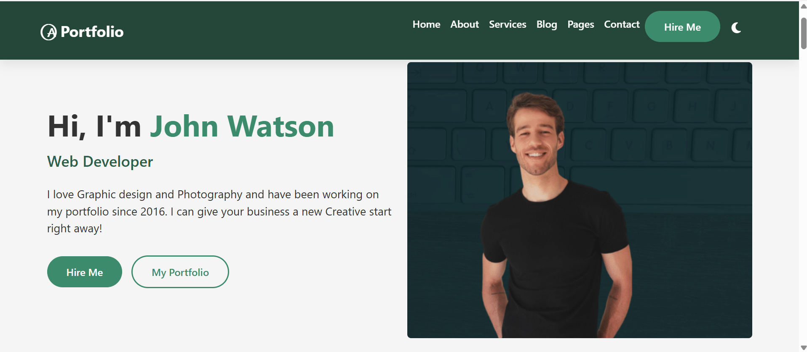

# 🎨 John Watson Portfolio Recreation 

  

## 🌟 Overview
A responsive portfolio website featuring dark/light mode toggle ☀️🌙, built with modern web technologies:

- 🏗️ HTML5 
- 🎨 CSS3 
- ⚡ JavaScript 
- 🅱️ Bootstrap 5 framework

## 🔍 How the Design Was Recreated

### 1. 🔎 Source Analysis
- 📸 Studied original images layout and components
- 🎨 Identified core color scheme (dark green/white) and typography
- 📝 Documented all sections and interactive elements

### 2. 🏗️ Structural Implementation

```html
<!-- Key Structural Components -->
<nav class="navbar">...</nav>            <!-- 🧭 Navigation -->
<section id="home" class="hero-section">...</section>      <!-- 🏠 Home -->
<section id="about" class="about-section">...</section>    <!-- 📖 About -->
<section id="services" class="services-section">...</section>  <!-- 🛠️ Services -->
<section id="blog" class="blog-section">...</section>    <!-- 💪 Blog -->
<section id="pages" class="pages-section">...</section> <!-- 🖼️ Pages -->
<section id="contact" class="contact-section">...</section>  <!-- 📞 Contact -->
<footer class="footer">...</footer>       <!-- 🦶 Footer -->
```

### 3. 🎨 Core Styling Implementation

```css
/* 🎨 Color Scheme */
:root {
  --dark-green: #1a3e2f;     /* 🌲 Dark green */
  --medium-green: #2d5e4a;   /* 🌿 Medium green */
  --light-green: #3d8b6d;    /* 🍀 Light green */
  --white: #ffffff;          /* ⬜ Pure white */
  --light-gray: #f5f5f5;     /* ⚪ Light gray */
}

/* 🌑 Dark Mode Variables */
[data-theme="dark"] {
  --dark-green: #3d8b6d;     /* 💚 Dark mode green */
  --white: #121212;          /* ⬛ Dark background */
  --light-gray: #1e1e1e;     /* ⚫ Dark gray */
}
```

### 4. 🕹️ Interactive Elements

**🌓 Dark/Light Mode Toggle:**
```javascript
// Theme toggle functionality
const themeToggle = document.getElementById('theme-toggle');
themeToggle.addEventListener('click', () => {
  document.body.toggleAttribute('data-theme');
  localStorage.setItem('theme', 
    document.body.hasAttribute('data-theme') ? 'dark' : 'light');
});
```

**🖱️ Portfolio Hover Effects:**
```css
.portfolio-item {
  transition: transform 0.3s;  /* ✨ Smooth transition */
}
.portfolio-item:hover {
  transform: scale(1.05);      /* 🔍 Zoom effect */
}
```

### 5. 📱 Responsive Features

```css
/* 📲 Mobile-first breakpoints */
@media (min-width: 576px) { /* 📱 Small devices */ }
@media (min-width: 768px) { /* 💻 Medium devices */ }
@media (min-width: 992px) { /* 🖥️ Large devices */ }
```

## 📂 Complete File Structure

```
/portfolio
│── index.html          # 📄 Main website structure
│── styles.css          # 🎨 Custom styling
│── script.js           # ⚡ Interactive functionality
└── /images             # 🖼️ All visual assets
    ├── profile.png     # 👨‍💻 Hero image
    ├── about.png       # 📖 Bio section image
    ├── work1-8.png     # 🖼️ Portfolio items
    └── skills.png      # 💪 Skills illustration
```

## ✨ Key Features

1. **🎨 Theme System**
   - 🖌️ CSS variable theming
   - 💻 OS preference detection
   - 💾 Persistent settings via localStorage

2. **📐 Layout Components**
   - 🟦 Bootstrap 5 grid system
   - 🃏 Custom card designs
   - 🖼️ Responsive image handling

3. **🔄 Interactive Elements**
   - ⬇️ Smooth scrolling navigation
   - ✅ Form validation
   - ✨ Hover animations

## 🛠️ Setup Instructions

1. Clone repository:
   ```bash
   git clone https://github.com/Junewahu/Web-Development-Group-468.git
   ```
2. Open `index.html` in your browser
3. Start customizing!

## 💻 Technologies Used

| Technology | Purpose |
|------------|---------|
|  HTML5 | Semantic markup |
|  CSS3 | Styling and layout |
|  JavaScript | Interactive functionality |
|  Bootstrap 5 | Responsive components |

## 📜 License
MIT License - Free for personal and commercial use 👍   

## Developers
Created by group 468: june mwangi - junewahu@gmail.com victor mikae - mikaev135@gmail.com evans mugendi - acemugendi6@gmail.com bolly kevin echessa - bollykevin75@gmail.com gift odoyo - otienogift1@gmail.com stellah wycliff - stellahdaniel71@gmail.com sibongakonke bhengu- snbhengu08@gmail.com ambuche david - ddoronje25@gmail.com nicole ochieng - nicoleochieng7@gmail.com